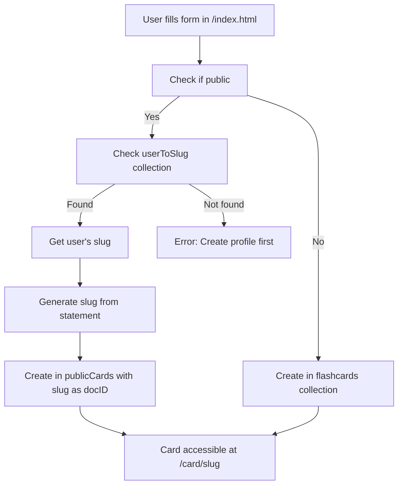
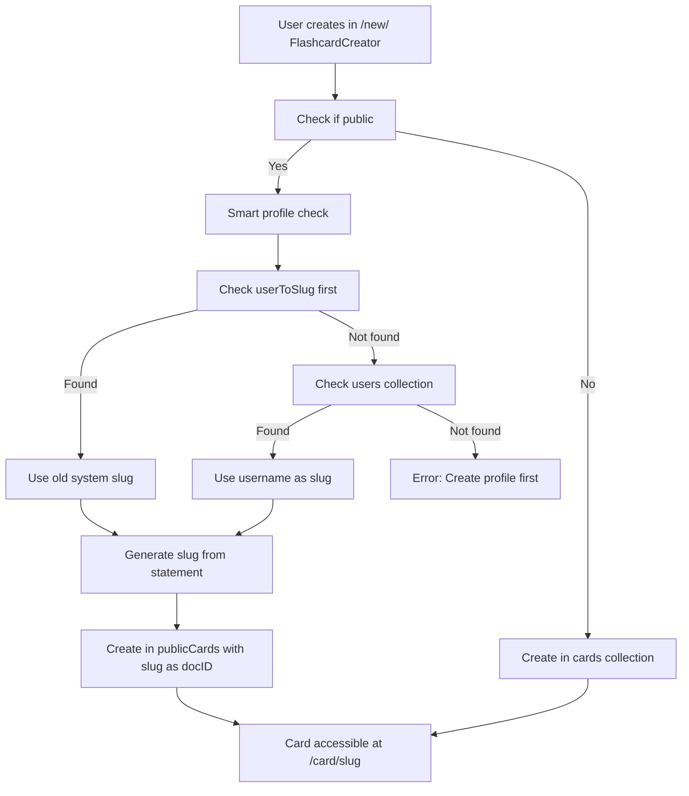
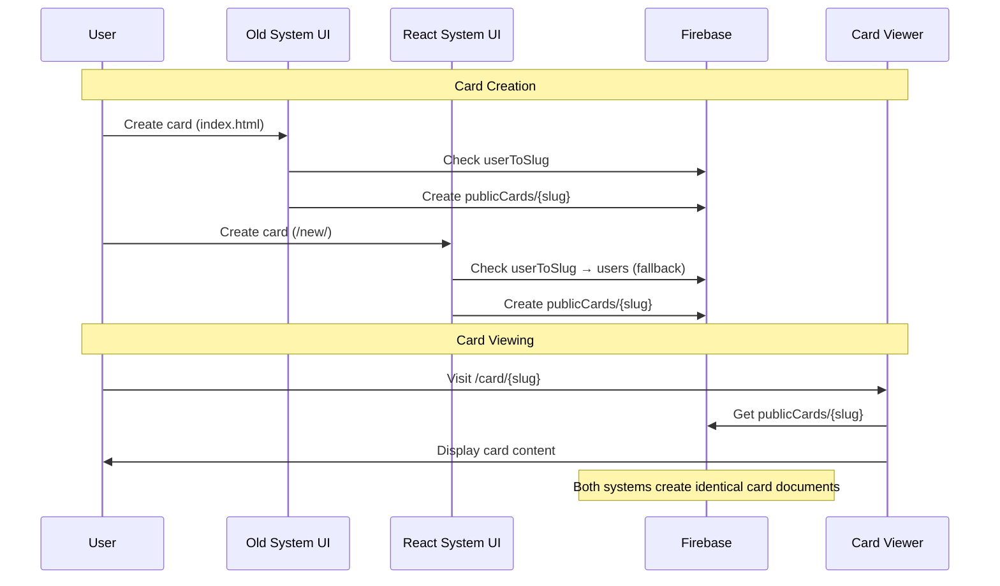
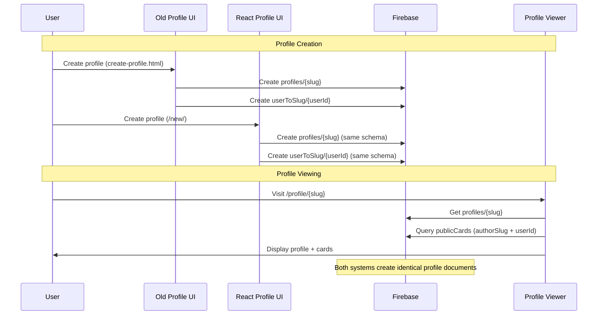

# 🏗️ Three-Sided System Architecture & Compatibility Guide

This document explains how the **old system** and **new React system** work together, their differences, and how backwards compatibility is maintained.

## 📋 Table of Contents
- [Overview](#overview)
- [Card Creation Systems](#card-creation-systems)
- [Profile Systems](#profile-systems)
- [Search & Discovery](#search--discovery)
- [Data Flow Diagrams](#data-flow-diagrams)
- [Compatibility Matrix](#compatibility-matrix)
- [Troubleshooting](#troubleshooting)

---

## 🌍 Overview

Three-Sided currently operates with **two parallel systems**:

| System | Path | Technology | Status |
|--------|------|------------|---------|
| **Old System** | `/` | Vanilla JS + Firebase | ✅ Production |
| **React System** | `/new/` | React + Vite + Firebase | ✅ Production |

**Key Philosophy**: Both systems share the **same Firebase backend** with **backwards compatibility** maintained through smart routing and dual-system support.

---

## 🎴 Card Creation Systems

### 📊 Comparison Table

| Feature | Old System | React System | Compatibility |
|---------|------------|--------------|---------------|
| **UI Location** | `/index.html` form | `/new/` FlashcardCreator | ✅ Same backend |
| **Collection Used** | `flashcards` | `cards` | ✅ Dashboard reads both |
| **Public Storage** | `publicCards` | `publicCards` | ✅ Same collection |
| **Slug Generation** | Manual (statement-based) | Automated (statement-based) | ✅ Same algorithm |
| **Document ID** | `slug` as doc ID | `slug` as doc ID | ✅ Compatible |
| **Profile Check** | `userToSlug` only | `userToSlug` → `users` fallback | ✅ Backwards compatible |

### 🔄 Old System Card Creation Flow



**Code Location**: `public/scripts/main/combinedController.js:117-143`

```javascript
// Old system code
await db.collection("publicCards").doc(uniqueSlug).set({
  ...cardData,
  userId,
  authorSlug: slug,           // Profile slug
  slug: uniqueSlug,          // Card slug
  createdAt: firebase.firestore.FieldValue.serverTimestamp(),
  likeCount: 0
});
```

### ⚛️ React System Card Creation Flow



**Code Location**: `src/services/flashcardService.js:125-162`

```javascript
// React system code (backwards compatible)
// First, try the old system (userToSlug collection)
const userSlugDoc = await getDoc(doc(db, 'userToSlug', userId));
if (userSlugDoc.exists()) {
  userSlug = userSlugDoc.data().slug;
} else {
  // Fallback to new system (users collection)
  const userDoc = await getDoc(doc(db, 'users', userId));
  if (userDoc.exists() && userDoc.data().username) {
    userSlug = userDoc.data().username;
  }
}

// Use setDoc with slug as document ID (like old system)
await setDoc(doc(db, 'publicCards', uniqueSlug), {
  statement: flashcardData.question || flashcardData.statement,
  userId: userId,
  authorSlug: userSlug,      // Profile slug
  slug: uniqueSlug,          // Card slug  
  id: uniqueSlug,            // Also store as id field
  createdAt: serverTimestamp(),
  likeCount: 0
});
```

### 🔍 Key Differences & Compatibility

| Aspect | Old System | React System | How Compatible |
|--------|------------|--------------|----------------|
| **Private Storage** | `flashcards` collection | `cards` collection | ✅ Dashboard reads both |
| **Public Storage** | `publicCards` with doc ID = slug | `publicCards` with doc ID = slug | ✅ Identical |
| **Profile Lookup** | Only `userToSlug` | `userToSlug` → `users` fallback | ✅ Old system works, React enhanced |
| **Slug Algorithm** | `statement.toLowerCase().replace(/[^a-z0-9]+/g, '-').slice(0, 50)` | Same algorithm | ✅ Identical slugs |

---

## 👤 Profile Systems

### 📊 Comparison Table

| Feature | Old System | React System | Compatibility |
|---------|------------|--------------|---------------|
| **Creation UI** | `/create-profile.html` | `/new/` ProfileCreator | ✅ Same backend schema |
| **Profile Storage** | `profiles/{slug}` | `profiles/{slug}` | ✅ Identical collection |
| **User Mapping** | `userToSlug/{userId}` | `userToSlug/{userId}` | ✅ Identical collection |
| **Slug Generation** | Manual validation | Automated with validation | ✅ Same algorithm |
| **Required Fields** | displayName, slug, bio, institution | Same + email | ✅ Compatible |

### 🔄 Old System Profile Creation Flow

```mermaid
graph TD
    A[User visits /create-profile.html] --> B[Fill form]
    B --> C[Generate slug from displayName]
    C --> D[Check if slug available]
    D -->|Available| E[Create profile/{slug}]
    D -->|Taken| F[Suggest alternative]
    E --> G[Create userToSlug/{userId}]
    G --> H[Redirect to /profile/{slug}]
```

**Code Location**: `public/create-profile.html:262-271`

```javascript
// Old system profile creation
await profileService.createProfile(user.uid, currentSlug, {
  displayName: displayName,
  bio: bio,
  institution: institution
});
// Creates:
// - profiles/{slug} document
// - userToSlug/{userId} document
```

### ⚛️ React System Profile Creation Flow

```mermaid
graph TD
    A[User in /new/ ProfileCreator] --> B[Fill form]
    B --> C[Generate slug from displayName]
    C --> D[Check if slug available]
    D -->|Available| E[Create profile/{slug}]
    D -->|Taken| F[Suggest alternative]
    E --> G[Create userToSlug/{userId}]
    G --> H[Update UI state]
```

**Code Location**: `src/services/profileService.js:66-102`

```javascript
// React system profile creation (identical schema)
await setDoc(doc(db, 'profiles', slug), {
  userId,
  displayName,
  bio,
  institution,
  email,
  createdAt: serverTimestamp(),
  // ... stats
});

await setDoc(doc(db, 'userToSlug', userId), { slug });
// Creates identical structure to old system
```

### 🔍 Profile Display Compatibility

**Old System Profile Page**: `/profile/{slug}`
- **Code**: `public/scripts/profile/publicCardService.js:3-49`
- **Query**: 
  ```javascript
  // OLD (before compatibility fix)
  db.collection("publicCards").where("authorSlug", "==", slug)
  
  // NEW (after compatibility fix)
  const queries = [
    db.collection("publicCards").where("authorSlug", "==", slug),
    db.collection("publicCards").where("userId", "==", userId)
  ];
  ```

**React System Profile**: `/new/` (when viewing profiles)
- Uses same backend queries
- Displays same data
- Full compatibility

---

## 🔍 Search & Discovery

### 📊 System Comparison

| Feature | Old System | React System | Data Source |
|---------|------------|--------------|-------------|
| **Search Page** | `/search.html` | `/new/` SearchAndDiscovery | `publicCards` |
| **Card Display** | Modal popup | Modal popup | Same data |
| **Card Links** | `/card/{slug}` | `/card/{slug}` | Same URLs |
| **Upvoting** | `userUpvotes` collection | Same collection | Shared backend |
| **Filtering** | JS filter on client | JS filter on client | Same logic |

### 🔄 Search Data Flow

```mermaid
graph TD
    A[User searches] --> B[Load all publicCards]
    B --> C[Client-side filtering]
    C --> D[Display results]
    D --> E[Click 'View']
    E --> F[Open /card/{slug}]
    F --> G[Old system card viewer]
    
    B2[User upvotes] --> H[Update userUpvotes]
    H --> I[Update publicCards.likeCount]
    
    style F fill:#e1f5fe
    style G fill:#e1f5fe
```

**Key Point**: Both systems use the **same search backend** and link to the **same card viewer** (`/card/{slug}`).

### 🔗 Card URL Routing

All card URLs follow the pattern: `/card/{slug}`

1. **Card Creation** (both systems) → Creates `publicCards/{slug}` document
2. **Search Results** (both systems) → Links to `/card/{slug}`
3. **Card Viewer** → `/card/index.html` or `/card/enhanced.html`
4. **Card Retrieval** → `db.collection("publicCards").doc(slug).get()`

---

## 📈 Data Flow Diagrams

### 🎴 Card Creation & Viewing Flow



### 👤 Profile Creation & Display Flow



---

## ✅ Compatibility Matrix

### 🎯 Full Compatibility Scenarios

| Scenario | Profile Created Via | Card Created Via | Result |
|----------|-------------------|------------------|---------|
| **Scenario 1** | Old system | Old system | ✅ Perfect |
| **Scenario 2** | Old system | React system | ✅ Works (backwards compatible) |
| **Scenario 3** | React system | Old system | ✅ Works (forwards compatible) |
| **Scenario 4** | React system | React system | ✅ Perfect |

### 🔍 Card Visibility Matrix

| Card Location | Old Dashboard | React Dashboard | Search Console | Profile Page |
|--------------|---------------|-----------------|----------------|--------------|
| `flashcards` collection | ✅ Shows | ✅ Shows | ❌ No (private) | ❌ No (private) |
| `cards` collection | ❌ No | ✅ Shows | ❌ No (private) | ❌ No (private) |
| `publicCards` collection | ✅ Shows | ✅ Shows | ✅ Shows | ✅ Shows |

**Note**: React dashboard reads **both** `flashcards` and `cards` collections for full compatibility.

---

## 🚨 Troubleshooting

### 💾 Cards Not Showing on Profile

**Problem**: Created cards in React but they don't appear on `/profile/{slug}`

**Root Cause**: No profile in `userToSlug` collection

**Solutions**:
1. Create profile via `/create-profile.html` 
2. Check if `userToSlug/{userId}` document exists
3. Verify `authorSlug` field in `publicCards` documents

**Debug Steps**:
```javascript
// Check if user has profile mapping
const userSlugDoc = await db.collection('userToSlug').doc(userId).get();
console.log('User has profile:', userSlugDoc.exists());

// Check cards by user
const userCards = await db.collection('publicCards').where('userId', '==', userId).get();
console.log('User cards:', userCards.docs.length);
```

### 🔗 Card URLs Return "Not Found"

**Problem**: Card appears in search but `/card/{slug}` shows "Card not found"

**Root Cause**: Document ID doesn't match slug

**Solution**: Cards created after the compatibility fix use `slug` as document ID

**Debug Steps**:
```javascript
// Check if card exists by slug
const cardDoc = await db.collection('publicCards').doc(slug).get();
console.log('Card exists by slug:', cardDoc.exists());

// Check all cards to find by different ID
const allCards = await db.collection('publicCards').where('slug', '==', slug).get();
console.log('Cards with this slug:', allCards.docs.length);
```

### 🔑 Permission Errors

**Problem**: `FirebaseError: Missing or insufficient permissions`

**Root Cause**: Firestore security rules blocking access

**Solution**: Updated rules to handle document creation and user ownership patterns

**Affected Collections**:
- `userUpvotes` - Fixed to allow document creation and user patterns
- `cardLikes` - Added rules for upvote system
- `studySessions` - Enhanced for analytics

---

## 🔮 Future Considerations

### 📦 Potential Migration Path

If you want to **fully unify** the systems in the future:

1. **Merge Collections**: Migrate `flashcards` → `cards`
2. **Consolidate UIs**: Use React as primary interface
3. **Maintain URLs**: Keep `/card/{slug}` and `/profile/{slug}` for SEO
4. **Data Cleanup**: Remove duplicate documents and unused collections

### 🎯 Recommended Best Practices

1. **Always use slug as document ID** for public content
2. **Check both profile systems** when creating public cards
3. **Maintain backwards compatibility** when adding new features
4. **Use consistent slug generation** across systems
5. **Test cross-system scenarios** when making changes

---

## 📚 Key File Locations

### 🏗️ System Architecture Files

| Component | Old System | React System |
|-----------|------------|--------------|
| **Card Creation** | `public/scripts/main/combinedController.js` | `src/services/flashcardService.js` |
| **Profile Creation** | `public/create-profile.html` | `src/services/profileService.js` |
| **Card Viewing** | `public/card/index.html` | Same (shared) |
| **Profile Viewing** | `public/scripts/profile/publicCardService.js` | Same (shared) |
| **Search System** | `public/search.html` | `src/components/SearchAndDiscovery.jsx` |
| **Database Rules** | `firestore.rules` | Same (shared) |

### 🔧 Configuration Files

- **Firebase Config**: `public/scripts/main/firebaseConfig.js` (old) + `src/firebase.js` (React)
- **Security Rules**: `firestore.rules` (shared)
- **Build Config**: `src/vite.config.js` (React) + Firebase hosting config

---

*This document should be updated when architectural changes are made to maintain accuracy.*
