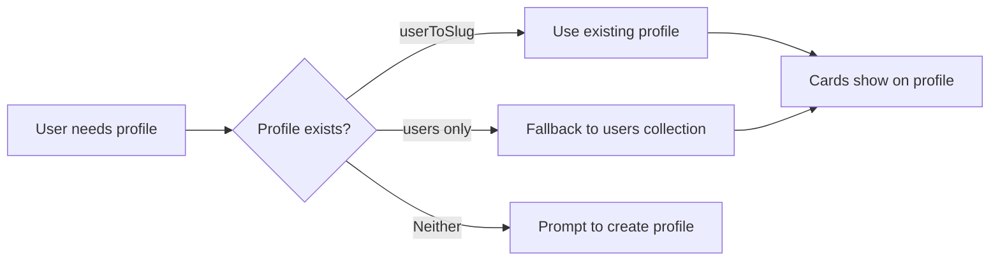

# 🚀 Three-Sided React Version

Welcome to the **React version** of Three-Sided! This is a modern rewrite of the flashcard app that works **seamlessly** with the existing system.

## 🔄 **Backwards Compatibility**

**Key Philosophy**: The React version is **100% backwards compatible** with the original system. They share the same Firebase backend and can be used interchangeably.

### ✅ **What Works Together**
- **Profiles**: Create with either system, works in both
- **Cards**: Create with either system, visible in both  
- **URLs**: Same `/card/{slug}` and `/profile/{slug}` format
- **Search**: Same backend, same results
- **Authentication**: Shared user accounts

## 🌟 **Enhanced Features**

### ✨ **React Version Improvements**
- **🎨 Modern UI** - Beautiful, responsive design
- **🤖 AI Integration** - DeepSeek-powered assistance  
- **📱 Better UX** - Smooth interactions and navigation
- **⚡ Performance** - Faster loading and interactions
- **🔧 Better Code** - React components and modern architecture

### 🆚 **System Comparison**

| Feature | Original (`/`) | React (`/new/`) | Compatibility |
|---------|----------------|-----------------|---------------|
| **Card Creation** | Basic form | ✅ **AI-assisted** | ✅ Same backend |
| **Profile System** | HTML forms | ✅ **React components** | ✅ Same schema |
| **Study Mode** | Static cards | ✅ **Interactive** | ✅ Same data |
| **Search & Discovery** | Functional | ✅ **Enhanced UX** | ✅ Same results |
| **Data Storage** | Firebase | ✅ **Same Firebase** | ✅ Perfect |

## 🚀 **Quick Start**

### **For Users**
1. **Visit**: `https://your-site.com/new/`
2. **Sign in**: Same Google account as original site
3. **Create**: Enhanced card creation with AI help
4. **Study**: Interactive study mode
5. **Discover**: Search and discover community cards

### **For Developers**
```bash
# Development
npm install
npm run dev

# Build for production  
npm run build

# Deploy (builds to ../public/new/)
firebase deploy --only hosting
```

## 🏗️ **System Architecture**

### **Shared Backend** (Firebase)
```
📁 Collections (Shared)
├── 📄 publicCards/        # Public flashcards  
├── 📄 profiles/           # User profiles
├── 📄 userToSlug/         # Profile slug mapping
├── 📄 flashcards/         # Private cards (old)
├── 📄 cards/              # Private cards (new)
└── 📄 userUpvotes/        # Upvote tracking
```

### **Frontend Systems**
```
📁 Original System (/)
├── 📄 index.html          # Card creation
├── 📄 search.html         # Search & discovery  
├── 📄 profile/            # Profile pages
└── 📄 card/               # Card viewer

📁 React System (/new/)
├── ⚛️ FlashcardCreator    # Enhanced creation
├── ⚛️ SearchAndDiscovery  # Modern search
├── ⚛️ UserDashboard       # Profile management  
└── ⚛️ StudyMode           # Interactive study
```

### **Key Compatibility Features**
- **Smart Profile Detection**: Checks both `userToSlug` and `users` collections
- **Dual Collection Support**: Reads both `flashcards` and `cards` for private cards
- **Same URL Structure**: `/card/{slug}` and `/profile/{slug}` work from either system
- **Shared Card Viewer**: Both systems link to same card display page

## 📚 **Understanding the Systems**

### **Card Creation Flow**
```mermaid
graph LR
    A[User creates card] --> B{Which system?}
    B -->|Original| C[index.html form]
    B -->|React| D[FlashcardCreator component] 
    C --> E[Same Firebase backend]
    D --> E
    E --> F[publicCards collection]
    F --> G[/card/slug URL works]
```

### **Profile Compatibility**


## 🔧 **Development Guidelines**

### **Backwards Compatibility Rules**
1. **Always check both profile systems** when creating public cards
2. **Use same slug generation** algorithm as original system  
3. **Store public cards** with slug as document ID
4. **Maintain URL patterns** (`/card/{slug}`, `/profile/{slug}`)
5. **Test cross-system scenarios** before deploying

### **Key Files to Understand**
```
src/
├── services/
│   ├── flashcardService.js    # Card creation with compatibility
│   ├── profileService.js      # Profile system (same schema)
│   └── userService.js         # User management
├── components/
│   ├── FlashcardCreator.jsx   # Enhanced card creation
│   ├── UserDashboard.jsx      # Reads both card collections
│   └── SearchAndDiscovery.jsx # Modern search interface
└── firebase.js               # Shared Firebase config
```

## 📖 **Further Reading**

- 📋 **[SYSTEM_ARCHITECTURE.md](../SYSTEM_ARCHITECTURE.md)** - Complete technical documentation
- 🔧 **[firestore.rules](../firestore.rules)** - Database security rules
- ⚙️ **[vite.config.js](./vite.config.js)** - Build configuration

## 🆘 **Troubleshooting**

### **Cards not showing on profile?**
- Check if profile exists in `userToSlug` collection
- Verify `authorSlug` field in `publicCards` documents

### **Card URLs returning 404?**
- Ensure document ID matches slug in `publicCards`
- Check if card was created after compatibility fixes

### **Permission errors?**
- Updated Firestore rules handle cross-system access
- Clear browser cache if issues persist

---

**💡 Remember**: Both systems work together seamlessly. Users can create profiles and cards with either system and everything will work perfectly! 🎯
